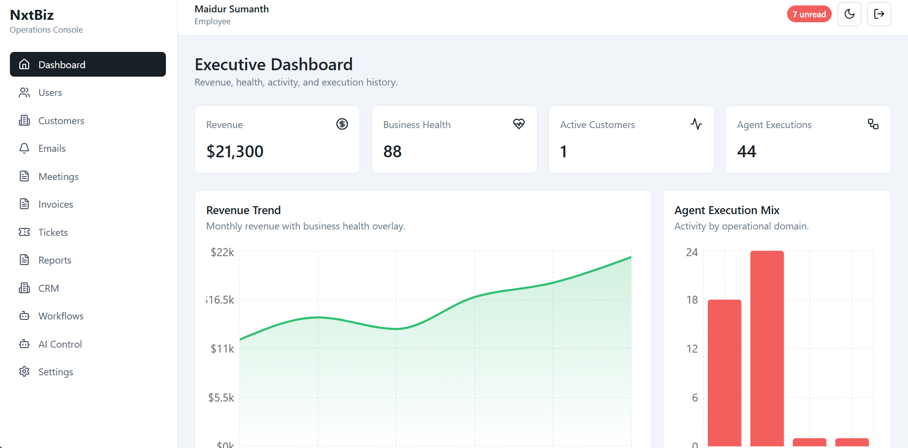

# 🚀 NxtBiz – AI Business Operations Automation Platform

## 📌 Overview

NxtBiz is a full-stack AI-powered Business Operations Automation Platform designed to streamline and automate daily business workflows.

The platform enables teams to manage customers, CRM activities, emails, meetings, invoices, support tickets, reports, workflows, notifications, and intelligent business automation through a single centralized dashboard.

NxtBiz combines modern web technologies with automation agents to reduce manual work and improve business efficiency.

---

## ✨ Features

### 🔐 Authentication & Authorization

* User Registration & Login
* JWT Authentication
* Refresh Token Management
* Role-Based Access Control
* Protected Routes

### 👥 Customer & CRM Management

* Customer Management
* Customer 360° View
* CRM Activity Timeline
* Customer Health Score
* Notes & Preferences

### 📧 Email Intelligence

* Email Processing
* Intent Detection
* Sentiment Analysis
* Urgency Classification
* Auto Response Suggestions

### 🤖 AI Agent Automation

* Intent Agent
* Task Planner Agent
* CRM Agent
* Email Agent
* Meeting Agent
* Invoice Agent
* Customer Support Agent
* Chief Of Staff Agent

### ⚙ Workflow Automation

* Workflow Builder
* Trigger-Based Actions
* Automated Execution
* Workflow Logs

### 📄 Reports & PDF Generation

* Invoice Generation
* Executive Reports
* Weekly Reports
* PDF Export

### 🔔 Real-Time Notifications

* Live Updates using Socket.IO
* Agent Execution Events
* Workflow Notifications

---

## 🛠 Tech Stack

### Frontend

* React.js
* Vite
* Tailwind CSS
* React Router
* TanStack Query
* Zustand
* Axios
* Framer Motion
* Recharts
* Socket.IO Client

### Backend

* Node.js
* Express.js
* MongoDB
* Mongoose
* JWT
* Zod Validation
* bcryptjs
* Redis
* BullMQ
* Socket.IO
* PDFKit

---

## 🏗 Project Architecture

```text
Client (React + Vite)
        ↓
REST APIs (Express.js)
        ↓
MongoDB Database
        ↓
Redis Queue
        ↓
Agent Orchestration
        ↓
Socket.IO Notifications
```

---

## 📂 Project Structure

```text
NxtBiz/
│
├── client/
│   ├── src/
│   ├── components/
│   ├── pages/
│   ├── services/
│   └── App.jsx
│
├── server/
│   ├── src/
│   │   ├── config/
│   │   ├── routes/
│   │   ├── controllers/
│   │   ├── models/
│   │   ├── services/
│   │   ├── middleware/
│   │   └── agents/
│
├── .env
├── package.json
└── README.md
```

---

## ⚡ Installation

### Clone Repository

```bash
git clone YOUR_REPOSITORY_URL
```

```bash
cd NxtBiz
```

---

### Install Dependencies

Frontend

```bash
cd client
npm install
```

Backend

```bash
cd ../server
npm install
```

---

## 🔧 Environment Variables

Create `.env`

```env
PORT=4000

MONGODB_URI=your_mongodb_uri

JWT_ACCESS_SECRET=your_secret

JWT_REFRESH_SECRET=your_secret

CLIENT_ORIGIN=http://localhost:5173
```

---

## ▶ Run Project

Backend

```bash
npm run dev
```

Frontend

```bash
npm run dev
```

---

## 📌 Core Modules

* Dashboard
* User Management
* Customer Management
* CRM
* Email Processing
* Meeting Management
* Invoice Management
* Support Tickets
* Reports
* Workflow Automation
* AI Control Center
* Notifications
* Memory Search

---

## 📈 Future Improvements

* Calendar Integration
* Email Provider Integration
* Payment Gateway
* Advanced Analytics
* Vector Database Memory
* AI Model Integration
* Multi-Tenant Architecture

---

## 📷 Screenshots



---

## 👨‍💻 Author

**Sumanth**

Built as a Full Stack MERN + Business Automation Project.

---

## ⭐ If you like this project

Give this repository a Star ⭐
